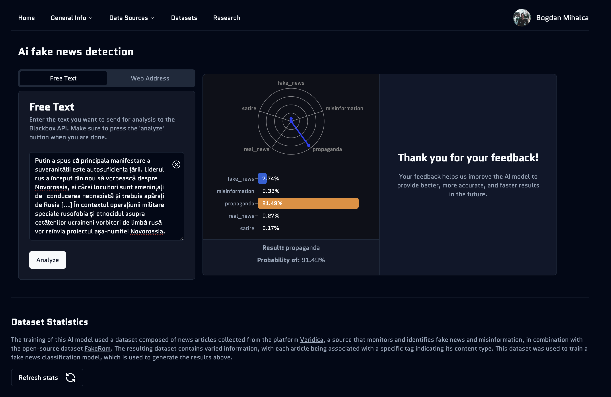
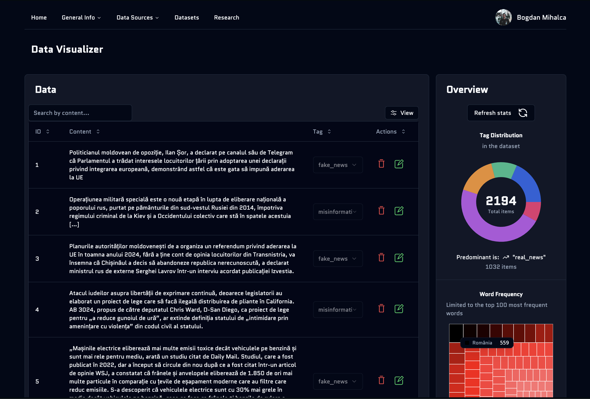

# Romanian Fake News Detection Platform

## 🌟 Overview

A sophisticated Next.js-based platform designed to combat misinformation in Romanian language content. This project implements browser-side inference using transformers.js, featuring both text-based and URL-based fake news detection capabilities.

[🔗 Live Demo](https://ai-fake-news-ro.vercel.app) <!-- Add your project URL here -->

[📄 Documentation](https://ai-fake-news-ro.vercel.app/research) <!-- Add your documentation URL here -->

## 📺 Screenshots




## 🚀 Key Features

- **Dual Input Methods**:
  - Direct text analysis
  - URL content extraction and analysis
- **Safe Browsing Integration**: URL safety verification using Google Safe Browsing API
- **Browser-Side ML Inference**: Optimized ONNX model implementation using transformers.js
- **Custom Dataset Development**: Created and curated FakeRom - a specialized Romanian fake news dataset
- **Modern UI Components**: Implemented using shadcn/ui with a focus on accessibility and user experience
- **Secure Authentication**: Robust user authentication system using NextAuth.js
- **Database Integration**: Prisma ORM with Neon Database for serverless PostgreSQL

## 🛠️ Technical Stack

### Frontend

- **Framework**: Next.js 14 with React 18
- **Visualization & Analytics**:
  - Interactive radar charts for multi-dimensional analysis
  - Vertical bar charts with dynamic scaling
  - Real-time probability visualization
  - Custom chart containers with tooltips
  - Responsive layout adapters
- **UI Components**:
  - shadcn/ui for consistent design
  - Radix UI primitives for accessibility
  - Custom chart configurations
  - Dynamic feedback forms
  - Loading state skeletons
- **State Management**:
  - React Hook Form with Zod validation
  - Client-side feedback handling
  - Real-time analysis updates
- **Content Processing**:
  - URL content extraction with Cheerio
  - Multiple fallback selectors for article extraction
  - Comprehensive meta-data parsing
  - Intelligent content cleaning

### Backend & Database

- **API Routes**:
  - Next.js API routes with TypeScript
  - Edge Runtime for optimal performance
  - Serverless functions with edge capabilities
  - Content extraction API with fallback strategies
  - Feedback collection endpoints
- **Database Architecture**:
  - Neon Database (Serverless PostgreSQL)
  - Prisma ORM with custom Neon adapter
  - Singleton pattern for connection management
  - Connection pooling with @neondatabase/serverless
  - Type-safe database operations
  - Edge-ready database configuration
  - Global prisma client optimization
- **Authentication & Authorization**:
  - NextAuth.js v5 with Prisma adapter
  - Role-based access control (RBAC)
  - Google OAuth integration
  - Protected routes based on user roles
  - Privileged access for dataset maintenance
- **Content Processing**:
  - Multi-stage content extraction pipeline
  - Hierarchical selector system
  - Meta-data parsing and cleaning
  - Article content validation
  - Error handling and response normalization

### Machine Learning

- **Model Architecture**:
  - Custom BERT model fine-tuned for Romanian fake news detection
  - Web Worker implementation for non-blocking inference
  - Singleton pattern for efficient model loading
  - Softmax processing for prediction probabilities
- **Browser Inference**:
  - @huggingface/transformers library with optimized pipeline
  - Edge-compatible model serving
  - Progress tracking during model loading
  - Label mapping for human-readable outputs
- **Dataset**:
  - Custom FakeRom dataset with 838 annotated articles
  - CRUD operations for authorized dataset maintenance
  - Role-based access control for data updates
- **Model Categories**:
  - Nuance detection
  - Satire identification
  - Propaganda analysis
  - Misinformation classification

### Development Tools

- **Language**: TypeScript
- **Linting**: ESLint with Next.js configuration
- **Bundle Analysis**: @next/bundle-analyzer
- **Performance Monitoring**:
  - Vercel Analytics
  - Vercel Speed Insights

## 📊 Dataset Development

The FakeRom dataset represents a significant contribution to Romanian language NLP resources:

- **Size**: 2194 annotated articles
- **Categories**: Multiple classification types (real, fake, misinformation, propaganda)
- **Source**: Curated from Romanian news website "veridica.ro"
- **Validation**: Manual verification and annotation process
- **Format**: Structured data suitable for ML training

## 🔒 Security Features

- **URL Safety**: Integration with Google Safe Browsing API
- **Authentication**: Secure user management with bcrypt password hashing
- **Data Protection**: Serverless PostgreSQL with secure connections
- **Input Validation**: Comprehensive request validation using Zod
- **API Security**: Protected routes and rate limiting

## ⚡ Performance Optimizations

### Database Optimizations

- Singleton pattern for Prisma client to prevent connection exhaustion
- Connection pooling with @neondatabase/serverless for optimal resource usage
- Edge-ready database configuration with PrismaNeon adapter
- Type-safe database operations with generated Prisma types

### Content Processing

- Hierarchical content extraction with fallback strategies
- Efficient HTML parsing with Cheerio
- Comprehensive selector system for different website structures
- Intelligent content cleaning and validation

### Frontend Optimizations

- Browser-side inference to reduce server load
- ONNX model optimization for faster predictions
- Tailwind CSS for optimal CSS bundle size
- Next.js automatic image optimization

## 🚀 Getting Started

```bash
# Clone the repository
git clone https://github.com/BogdanMihalca/AI_fake-news-ro.git

# Install dependencies
npm install

# Set up environment variables
cp .env.example .env.local

# Run database migrations
npx prisma migrate dev

# Start development server
npm run dev
```

## 🔧 Environment Variables

```env
# Authentication
AUTH_GOOGLE_ID="your-google-client-id"
AUTH_GOOGLE_SECRET="your-google-client-secret"
AUTH_SECRET="your-auth-secret"

# Database Configuration
POSTGRES_DATABASE="your-database-name"
POSTGRES_HOST="your-neon-host"
POSTGRES_PASSWORD="your-password"
POSTGRES_USER="your-username"
POSTGRES_PRISMA_URL="your-prisma-url"
POSTGRES_URL="your-postgres-url"
POSTGRES_URL_NON_POOLING="your-non-pooling-url"
POSTGRES_URL_NO_SSL="your-no-ssl-url"

# API Keys
GOOGLE_SAFE_BROWSING_API_KEY="your-safe-browsing-api-key"
```

## 📈 Future Improvements

- [ ] Expand dataset with more Romanian language sources
- [ ] Implement multi-language support
- [ ] Add real-time collaborative fact-checking features
- [ ] Enhance model accuracy through continuous training
- [ ] Develop API endpoints for third-party integration

## 📄 License

[MIT License](LICENSE)

## 🤝 Contributing

Contributions are welcome! Feel free to submit a pull request or open an issue.

---

Built with ❤️ for fighting misinformation in Romanian language content
